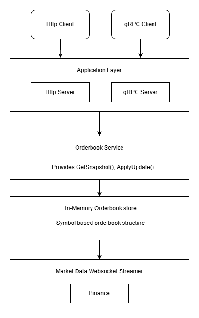

# Market Data Hub

Market Data Hub is a high-performance Go application that ingests real-time crypto market data (currently Binance), builds in-memory order books, and streams updates to clients over WebSocket.
It also exposes a gRPC interface for retrieving real-time order book snapshots.

|  | 
|:--:| 
| *Architecture diagram* |

## Features

### 1. WebSocket real-time market data streaming
- Clients subscribe to topics such as `btcusdt@depth`
- Server broadcasts incremental depth updates
- Order book reset events are also published
- Supports multiple integrations in the future

### 2. In-memory Order Book Management
Each symbol maintains a `SymbolState` with:
- Current order book snapshot
- Update channel for depth updates
- Buffered events for out-of-sync handling
- Reset logic

### 3. gRPC Snapshot API
Provides the current complete order book:
```proto
rpc GetSnapshot(OrderBookSnapshotRequest) returns (OrderBookSnapshotResponse);
```

Used together with CLI commands.

### 4. Suports three levels of configuration
- Supports `--config config.yaml`
- Environment variable overrides (`MDH_*`)
- Dynamic subscriptions via YAML config

### 5. Graceful Shutdown
- OS signal handling
- HTTP server graceful stop
- Order book synchronization termination

## Installation

**1. Clone the repository:**
```bash
git clone https://github.com/ChethiyaNishanath/market-data-hub.git
cd market-data-hub
```

**2. Install dependencies:**
```bash
go mod tidy
```

## Configuration

Create a `config.yaml`:
```yaml
server:
  port: 8084
  shutdownTimeout: 10

integrations:
  binance:
    wsStreamUrl: "wss://stream.binance.com:9443/ws"
    restApiUrlV3: "https://api.binance.com/api/v3"
    subscriptions: "BTCUSDT, BNBBTC, ETHBTC"

logging:
  level: "INFO"
```

## Running the Server

The system uses Cobra commands.

Start the HTTP and gRPC servers:
```bash
market-data-hub serve --config config.yaml
```

Console output:
```
Configuration initialized. Using config file: config.yaml
Server starting on port 8080
gRPC server running on :50051
```

## Fetching Order Book Snapshot via gRPC
```bash
market-data-hub snapshot --symbol BTCUSDT
```

Sample output:
```json
{
  "symbol": "BTCUSDT",
  "bids": [...],
  "asks": [...],
  "lastUpdateId": 123456789
}
```

## WebSocket Usage

### Connect
```
ws://localhost:8080/ws
```

Initial handshake response:
```json
{
  "client_id": "ee91aacd-519c-4df9-8124-d2fadb50c087"
}
```

### Subscribe to a topic
```json
{
  "method": "subscribe",
  "params": {
    "topic": "btcusdt@depth"
  }
}
```

Sample server push update:
```json
{
  "topic": "btcusdt@depth",
  "data": {
    "lastUpdateId": 987654321,
    "bids": [["43000.12", "0.152"]],
    "asks": [["43002.00", "1.114"]]
  }
}
```

### Order Book Reset Notification
```json
{
  "topic": "btcusdt@reset",
  "data": {
    "event": "orderbook_reset",
    "symbol": "BTCUSDT"
  }
}
```

## CLI

List all commands
```bash
market-data-hub --help
```

Server
```bash
market-data-hub serve --config config.yaml
```

Snapshot
```bash
market-data-hub snapshot --symbol ETHUSDT
```

## Testing

Unit tests
```bash
go test ./unit/...
```

Integration tests
```bash
go test ./it/...
```

## In-Memory Order Book Access

Accessed from:
- WebSocket broadcast
- REST handlers
- gRPC server
- Internal modules

Singleton via:
```go
marketstate.GetOrderBookStore()
```